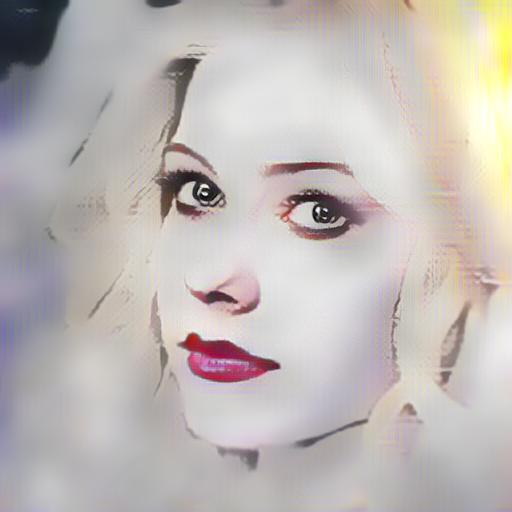
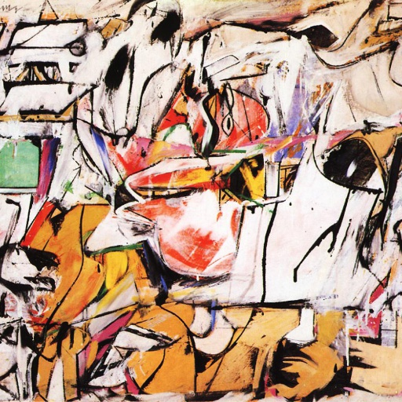
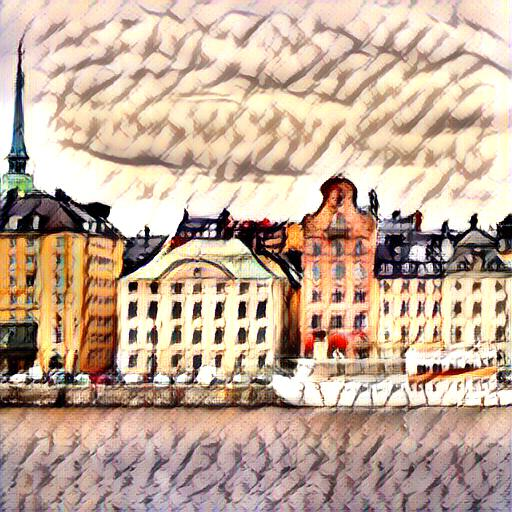
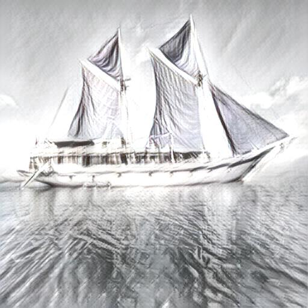

# Arbitrary Style Transfer - AdaIN

Tensorflow 2 implementation of [Arbitrary Style Transfer in Real-time with Adaptive Instance Normalization ](https://arxiv.org/abs/1703.06868)
which introduces the _adaptive instance normalization_ (AdaIN) layer, allowing for style transfer of arbitrary style images. 

This implementation is based on the original [Torch implementation](https://github.com/xunhuang1995/AdaIN-style)
and also on the great unofficial [pytorch implementation](https://github.com/naoto0804/pytorch-AdaIN).

## Examples

<div align="center">
  
  
  
  
  
  
  
</div>
<div align="center">
  
  
  
  
  
  
  
</div>
<div align="center">
  
  
  
  
  
  
  
</div>

## Requirements

Create a Python 3.7 virtual environment and activate it:

```bash
virtualenv -p python3.7 venv
source ./venv/bin/activate
```

Next, install the required dependencies:

```bash
pip install -r requirements.txt
```

## Usage

To style an image using a pre-trained model specify the content and style image as well
as the directory of the model checkpoint.

### Style image

```bash
python style.py \
    --log-dir model/ \
    --content-image images/content/avril_cropped.jpg \
    --style-image images/style/impronte_d_artista_cropped.jpg \
    --output-image images/output/avril_stylized.jpg \
    --alpha 1.0
```

The `alpha` parameter makes it possible to control the level of 
stylization of the content image. Varying `alpha` between 0 and 1 (default):

<div align="center">
  
  
  
</div>
 

### Train model

Training requires both the [MSCOCO](http://mscoco.org/dataset/#download) and the WikiArt datasets, the first one
is automatically downloaded and converted to tfrecords using [Tensorflow datasets](https://www.tensorflow.org/datasets).
The style images however needs to be downloaded from [here](https://www.kaggle.com/c/painter-by-numbers).

To start training, simply run:

```bash
python train.py \
    --style-dir WIKIART_IMAGE_DIR \
    --log-dir model/
```
where `WIKIART_IMAGE_DIR` is the location of the WikiArt images.
Training `160 000` steps with default parameters takes about 6 hours on a Tesla P100 GPU.

To track metrics and see style progress, start `Tensorboard`

```bash
tensorboard --logdir model/
```

and navigate to [localhost:6006](localhost:6006).


